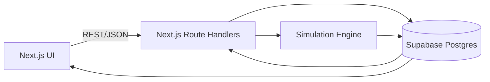

# PM Simulator — Architecture & Milestones

Last updated: 2026-02-06

## Objectives

- Ship a fun-first, fast-decision single-player game that feels like PM work without becoming PM work.
- Preserve uncertainty and tradeoffs while keeping interactions quick and legible.
- Support one save slot per session with a lightweight resume flow.
- Keep a clean separation between content, simulation logic, and presentation.

## Stack

- Frontend: Next.js (App Router) + TypeScript deployed on Vercel.
- Backend: Next.js Route Handlers for game actions.
- Database: Supabase Postgres with Row Level Security keyed by anonymous session id.
- Content: Seeded from `pm-simulator-db/*.json` into Supabase tables, versioned in git.

## High-Level Architecture

## Core Components

### 1) UI Layer

- Screens mapped from `opus_mocks`.
- Client calls API for state transitions and renders the resulting game snapshot.
- Minimal client-side logic beyond input validation and optimistic loading states.

### 2) Simulation Engine

- Pure, deterministic functions with an injected RNG seed.
- Lives in shared server code so outcomes cannot be manipulated by the client.

Responsibilities are handled by server-side simulation utilities.

- Generate backlog (context-weighted).
- Resolve ticket outcomes and apply metric deltas.
- Trigger events and CEO focus shifts.
- Produce Sprint Retro, Product Pulse, Quarterly Review, and Year-End Review.

### 3) Persistence Layer

- A normalized core for sessions and games.
- JSONB columns for nested or rapidly changing structures to keep schema lean.
- Content tables for ticket templates, narratives, and events.

## Data Model Mapping (Supabase)

Recommended minimal schema aligned with the PRD and data model.

**sessions**
- `id` (uuid)
- `created_at`, `last_active`
- `active_game_id` (uuid, nullable)
- `completed_games` (jsonb array)

**games**
- `id` (uuid)
- `session_id` (uuid)
- `difficulty` (enum)
- `current_quarter`, `current_sprint`
- `state` (enum)
- `metrics_state` (jsonb)
- `events_log` (jsonb array)
- `rng_seed` (int)
- `created_at`, `updated_at`

**sprints**
- `id` (uuid)
- `game_id` (uuid)
- `quarter`, `number`
- `effective_capacity`
- `backlog` (jsonb array of Ticket)
- `committed` (jsonb array of Ticket)
- `retro` (jsonb)

**quarters**
- `id` (uuid)
- `game_id` (uuid)
- `number`
- `ceo_focus`
- `product_pulse` (jsonb)
- `quarterly_review` (jsonb)

**year_end_review**
- `game_id` (uuid)
- `review` (jsonb)

**ticket_templates**
- `id` (string)
- `category`
- `payload` (jsonb)

**event_catalog**
- `id` (string)
- `payload` (jsonb)

**narrative_templates**
- `id` (string)
- `payload` (jsonb)

## API Endpoints

- `POST /api/session/init` creates or resumes a session id and returns active game state.
- `POST /api/game/new` starts a new game, initializes metrics, and generates Sprint 1 backlog.
- `POST /api/sprint/commit` commits tickets, resolves outcomes, and returns Sprint Retro.
- `POST /api/quarter/advance` generates Product Pulse and Quarterly Review, sets next CEO focus.
- `POST /api/game/complete` generates Year-End Review and archives CompletedGameSummary.

## Content Pipeline

- Use the JSON files in `pm-simulator-db` as the source of truth.
- One-time seed and repeatable upsert scripts populate content tables.
- Content ids remain stable to keep replays and analytics consistent.

## Milestones

### M0: Repository Baseline

- Initial commit with docs, mocks, and content files.
- `.gitignore` created and GH remote configured.

### M1: Foundation

- Next.js app scaffold with base routing and layout.
- Supabase project connected with env vars wired for local and Vercel.
- Session initialization and single save slot support.
- Seed script loads ticket templates, narratives, and events into Supabase.
- Exit criteria: a user can start a new game and resume it after refresh.

### M2: Sprint Loop (Core Gameplay)

- Backlog generation with context weighting.
- Ticket commit, capacity validation, and overbooking rules.
- Outcome resolution and metric updates.
- Sprint Retro generation.
- Exit criteria: complete 1 sprint end-to-end with visible metric changes.

### M3: Quarter Loop

- CEO focus selection and mid-quarter shift events.
- Quarterly Product Pulse and Quarterly Review generation.
- Roadmap hijack ticket injection for low sentiment.
- Exit criteria: finish a full quarter with review and pulse surfaced.

### M4: Full Run + Year-End Review

- Four-quarter progression, game completion state.
- Year-End Review with bell-curve calibration.
- Completed game summary visible on Home screen.
- Exit criteria: full one-year run playable without errors.

### M5: UX, Tone, and Balance Pass

- Narrative tone polishing using provided templates.
- Visual polish and motion cues per mocks.
- Balance tuning against PRD success criteria.
- Exit criteria: a stable build suitable for external testing.

## Risks and Mitigations

- Balance complexity: keep core formulas server-side and version them per release.
- Content bloat: use JSONB and stable template ids to avoid schema churn.
- Perceived randomness: ensure narratives explain outcomes and tradeoffs clearly.
