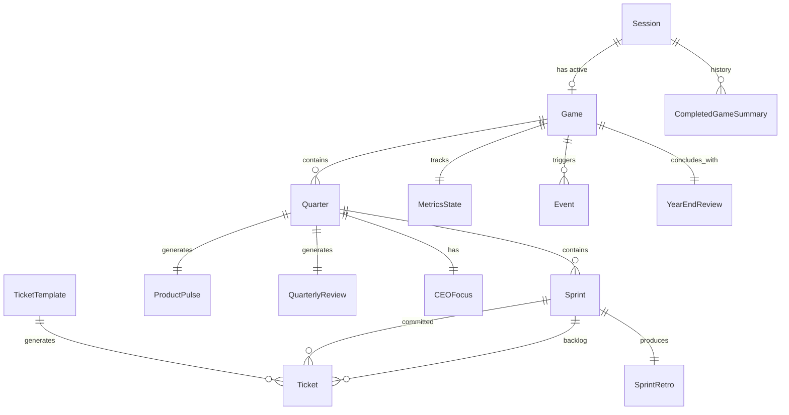

# PM Simulator — Data Model & Balance Document

## Entity-Relationship Overview



```
┌─────────────────────────────────────────────────────────────────────┐
│                           SESSION                                    │
│  session_id (cookie) ──► identifies player, persists across visits   │
│  active_game ──► at most one in-progress game (single save slot)    │
│  completed_games[] ──► lightweight history of past runs              │
│                                                                      │
│  ┌─────────────────────────────────────────────────────────────────┐ │
│  │                            GAME                                 │ │
│  │  ┌─────────────┐                                                │ │
│  │  │MetricsState  │◄──── updated every sprint resolution          │ │
│  │  │(visible +    │                                                │ │
│  │  │ hidden)      │                                                │ │
│  │  └─────────────┘                                                │ │
│  │                                                                  │ │
│  │  ┌──────────── QUARTER (x4) ────────────────────────────────┐   │ │
│  │  │                                                           │   │ │
│  │  │  CEOFocus ─── shifts at quarter start or via Event        │   │ │
│  │  │                                                           │   │ │
│  │  │  ┌──── SPRINT (x3) ──────────────────────────────────┐   │   │ │
│  │  │  │                                                    │   │   │ │
│  │  │  │  Backlog ──► [Ticket, Ticket, Ticket, ...]         │   │   │ │
│  │  │  │                    ▼ player selects                 │   │   │ │
│  │  │  │  Committed ──► [Ticket, Ticket]                    │   │   │ │
│  │  │  │                    ▼ game resolves                  │   │   │ │
│  │  │  │  SprintRetro ──► outcomes + narrative               │   │   │ │
│  │  │  │                                                    │   │   │ │
│  │  │  └────────────────────────────────────────────────────┘   │   │ │
│  │  │                                                           │   │ │
│  │  │  ProductPulse ──► qualitative signals (end of quarter)    │   │ │
│  │  │  QuarterlyReview ──► rating + narrative                   │   │ │
│  │  │                                                           │   │ │
│  │  └───────────────────────────────────────────────────────────┘   │ │
│  │                                                                  │ │
│  │  Events ──► can fire between any sprints                         │ │
│  │  YearEndReview ──► final bell-curved rating                      │ │
│  │                                                                  │ │
│  └─────────────────────────────────────────────────────────────────┘ │
│                                                                      │
└─────────────────────────────────────────────────────────────────────┘
```

---

## 1. Session

Identifies a player via cookie. One save slot — starting a new game abandons the current one.

| Attribute | Type | Values | Notes |
|---|---|---|---|
| `session_id` | string | uuid | Set via cookie on first visit |
| `created_at` | timestamp | — | — |
| `last_active` | timestamp | — | Updated on every player action |
| `active_game_id` | string / null | uuid | The in-progress game, if any. Null if no game in progress. |
| `completed_games` | CompletedGameSummary[] | — | History of finished runs, displayed on start screen |

### CompletedGameSummary

Lightweight record for the start screen and replay stats. Not the full Game object.

| Attribute | Type | Values | Notes |
|---|---|---|---|
| `game_id` | string | uuid | — |
| `difficulty` | enum | `easy`, `normal`, `hard` | — |
| `final_rating` | enum | see Year-End Review | — |
| `completed_at` | timestamp | — | — |

### Session Lifecycle

**First visit:** Generate `session_id`, set cookie (long expiry — 1 year), create Session with `active_game_id: null` and empty `completed_games`.

**New Game:** Create a Game, set `active_game_id` to it. If there's already an active game, it's abandoned (not added to `completed_games` — you don't get credit for quitting).

**Saved Game / Resume:** Load the Game referenced by `active_game_id`. Player picks up at their current sprint.

**Game Over:** Move `active_game_id` → `completed_games` as a CompletedGameSummary, set `active_game_id: null`. Player returns to start screen.

**Cookie expires / cleared:** Session is lost. No recovery in v1. Auth and persistent saves are a v2 concern.

---

## 2. Game

The top-level container for a single playthrough.

| Attribute | Type | Values | Notes |
|---|---|---|---|
| `id` | string | uuid | — |
| `session_id` | string | uuid | Foreign key to Session |
| `difficulty` | enum | `easy`, `normal`, `hard` | Set at start, immutable |
| `current_quarter` | int | 1–4 | — |
| `current_sprint` | int | 1–3 | Within current quarter |
| `state` | enum | `in_progress`, `completed` | — |
| `final_rating` | enum | see Year-End Review | null until game ends |
| `events_log` | Event[] | — | Running record of all triggered events |
| `created_at` | timestamp | — | — |
| `updated_at` | timestamp | — | Auto-saved after each sprint resolution |

---

## 3. MetricsState

A single mutable object on the Game. Updated after every sprint resolution. This is the beating heart of the simulation.

### Visible Metrics (shown to player as trends, never exact numbers)

| Metric | Internal Range | Starting Value (Normal) | Display | Player Description |
|---|---|---|---|---|
| `team_sentiment` | 0–100 | 60 | Face (5 tiers) | Morale and willingness to execute |
| `ceo_sentiment` | 0–100 | 50 | Face (5 tiers) | CEO's confidence in you |
| `sales_sentiment` | 0–100 | 50 | Face (5 tiers) | Sales team satisfaction |
| `cto_sentiment` | 0–100 | 50 | Face (5 tiers) | CTO's confidence in technical direction |
| `self_serve_growth` | 0–100 | 40 | Trend arrow (5 tiers) | User acquisition and subscription momentum |
| `enterprise_growth` | 0–100 | 40 | Trend arrow (5 tiers) | Large-deal and strategic traction |
| `tech_debt` | 0–100 | 35 | Trend arrow (5 tiers, inverted — high = bad) | System fragility and maintenance burden |

### Hidden Metrics (never shown directly — surface through Product Pulse and events)

| Metric | Internal Range | Starting Value (Normal) | Derivation |
|---|---|---|---|
| `nps` | 0–100 | 55 | Influenced by UX tickets, monetization tickets, tech debt level |
| `velocity` | int (points) | 20 | Derived from team sentiment + tech debt (see Capacity formula) |

### Display Tiers

**Sentiment faces:**

| Range | Display |
|---|---|
| 0–20 | Very Unhappy |
| 21–40 | Unhappy |
| 41–60 | Neutral |
| 61–80 | Happy |
| 81–100 | Very Happy |

**Trend arrows (growth metrics):**

| Range | Display |
|---|---|
| 0–20 | Strong Decline ↓↓ |
| 21–40 | Declining ↓ |
| 41–60 | Flat → |
| 61–80 | Growing ↑ |
| 81–100 | Surging ↑↑ |

**Tech debt arrows (inverted — high is bad):**

| Range | Display |
|---|---|
| 0–20 | Healthy ↓↓ |
| 21–40 | Manageable ↓ |
| 41–60 | Mounting → |
| 61–80 | Critical ↑ |
| 81–100 | Crisis ↑↑ |

### Difficulty Modifiers on Starting Values

| Metric | Easy | Normal | Hard |
|---|---|---|---|
| team_sentiment | 70 | 60 | 50 |
| ceo_sentiment | 60 | 50 | 40 |
| sales_sentiment | 60 | 50 | 40 |
| cto_sentiment | 60 | 50 | 45 |
| self_serve_growth | 50 | 40 | 30 |
| enterprise_growth | 50 | 40 | 30 |
| tech_debt | 25 | 35 | 50 |
| nps | 60 | 55 | 45 |

---

## 4. Quarter

| Attribute | Type | Values | Notes |
|---|---|---|---|
| `number` | int | 1–4 | — |
| `ceo_focus` | enum | `self_serve`, `enterprise`, `tech_debt` | Set at quarter start, can shift mid-quarter via Event |
| `product_pulse` | ProductPulse | — | Generated at end of quarter |
| `quarterly_review` | QuarterlyReview | — | Generated at end of quarter |
| `hijack_tickets` | Ticket[] | — | Forced tickets from unhappy stakeholders |

### CEO Focus Selection

At the start of each quarter, the CEO's focus is selected with weighted randomness. The weights shift based on game state, creating the feeling that the CEO is reacting to problems (but not always the right ones).

| CEO Focus | Base Weight | Boosted When |
|---|---|---|
| `self_serve` | 35% | self_serve_growth < 35 |
| `enterprise` | 35% | enterprise_growth < 35 |
| `tech_debt` | 30% | tech_debt > 65 |

When a boosting condition is met, that focus gets +20% weight (others reduced proportionally). Multiple conditions can be active.

**Mid-quarter shift probability:**

| Difficulty | Chance per Sprint | Trigger |
|---|---|---|
| Easy | 5% | Random event only |
| Normal | 10% | Random event only |
| Hard | 15% | Random event, sometimes spontaneous |

---

## 5. Sprint

| Attribute | Type | Values | Notes |
|---|---|---|---|
| `quarter` | int | 1–4 | — |
| `number` | int | 1–3 | Within quarter |
| `base_capacity` | int | 20 | Fixed |
| `effective_capacity` | int | ~11–30 | Derived (see formula) |
| `backlog` | Ticket[] | 7–10 tickets | Randomly generated with context weighting |
| `committed` | Ticket[] | — | Player-selected, can overbook by up to 25% |
| `is_overbooked` | bool | — | True if committed effort > effective_capacity |
| `overbooking_amount` | int | 0–5 | Points beyond capacity |
| `retro` | SprintRetro | — | Generated after resolution |

### Effective Capacity Formula

```
effective_capacity = base_capacity
                   + team_sentiment_modifier
                   + tech_debt_modifier
                   + cto_bonus
```

| Modifier | Condition | Value |
|---|---|---|
| **team_sentiment_modifier** | sentiment > 75 | +4 |
| | sentiment 50–75 | +1 |
| | sentiment 25–50 | -2 |
| | sentiment < 25 | -5 |
| **tech_debt_modifier** | debt < 25 | +2 |
| | debt 25–50 | 0 |
| | debt 50–75 | -3 |
| | debt > 75 | -6 |
| **cto_bonus** | CTO sentiment > 80 | +4 |
| | otherwise | 0 |

**Typical effective capacity ranges:**

| Scenario | Approximate Capacity |
|---|---|
| Great shape (high morale, low debt, CTO happy) | 26–30 |
| Healthy default | 20–22 |
| Struggling (low morale or high debt) | 15–18 |
| Crisis (both low morale and high debt) | 11–14 |

### Overbooking Rules

Players can commit tickets totaling up to **125% of effective capacity** (the extra 25% represents stretch goals). Overbooking has consequences:

| Effect | Value |
|---|---|
| team_sentiment hit | -5 per sprint (even if outcomes are good) |
| Additional team_sentiment hit if any ticket fails | -5 on top of normal failure penalties |
| All tickets in sprint: catastrophe chance | +5% absolute |
| All tickets in sprint: soft_failure chance | +10% absolute |
| All tickets in sprint: clear_success chance | -10% absolute |

---

## 6. Ticket

The core unit of player decision-making.

| Attribute | Type | Values | Notes |
|---|---|---|---|
| `id` | string | uuid | — |
| `title` | string | — | Short, evocative, corporate-speak |
| `description` | string | — | 1–2 sentences. States expected impact AND tradeoff |
| `category` | enum | See below | Determines metric affinities |
| `effort` | int | 2–10 | Story points |
| `is_mandatory` | bool | false | True for roadmap hijacks |
| `ceo_aligned` | bool | — | Computed: does this ticket's category match CEO focus? |
| `primary_metric` | string | — | Which metric benefits most on success |
| `secondary_metric` | string | null | Optional second beneficiary |
| `tradeoff_metric` | string | null | Which metric takes a hit |
| `outcome` | enum | null until resolved | See Outcome Resolution |
| `outcome_narrative` | string | null | Dry retro text |

### Ticket Categories

| Category | Primary Metric | Common Tradeoff | Effort Range | Frequency in Backlog |
|---|---|---|---|---|
| `self_serve_feature` | self_serve_growth | tech_debt ↑ or team_sentiment ↓ | 4–8 | 1–2 per sprint |
| `enterprise_feature` | enterprise_growth, sales_sentiment | team_sentiment ↓ or self_serve_growth ↓ | 5–8 | 1–2 per sprint |
| `tech_debt_reduction` | tech_debt ↓, cto_sentiment ↑ | No direct growth | 3–6 | 1–2 per sprint |
| `ux_improvement` | nps ↑, self_serve_growth | Minimal | 3–5 | 0–1 per sprint |
| `infrastructure` | tech_debt ↓ | No direct growth, team_sentiment ↓ (boring work) | 4–7 | 0–1 per sprint |
| `monetization` | self_serve_growth or enterprise_growth | nps ↓ | 4–7 | 0–1 per sprint |
| `sales_request` | sales_sentiment ↑, enterprise_growth | team_sentiment ↓, tech_debt ↑ | 5–8 | Context-dependent |
| `moonshot` | Multiple metrics ↑ (big) | tech_debt ↑, higher failure chance | 8–10 | 0–1 per sprint |

### Context-Weighted Backlog Generation

The 7–10 tickets generated each sprint aren't purely random. Current game state influences the distribution:

| Condition | Effect on Backlog |
|---|---|
| sales_sentiment < 35 | +1 extra `sales_request` ticket |
| tech_debt > 60 | +1 extra `tech_debt_reduction` ticket |
| enterprise_growth < 30 | +1 extra `enterprise_feature` ticket |
| self_serve_growth < 30 | +1 extra `self_serve_feature` ticket |
| Sprints 10–12 (end of year) | More `moonshot` tickets appear (desperation) |

This ensures the player always feels the pressure of their neglected areas surfacing in the backlog.

### Metric Impact Values by Outcome

These are the delta values applied to MetricsState when a ticket resolves.

**On clear success:**

| Impact Target | Delta Range | Notes |
|---|---|---|
| Primary metric | +6 to +12 | Scaled by effort (higher effort = higher ceiling) |
| Secondary metric | +2 to +5 | — |
| Tradeoff metric | -2 to -5 | The cost of doing business |
| Sentiment (relevant stakeholder) | +3 to +6 | — |

**On partial success:**

| Impact Target | Delta Range | Notes |
|---|---|---|
| Primary metric | +2 to +6 | ~50% of success values |
| Secondary metric | +1 to +3 | — |
| Tradeoff metric | -1 to -3 | Reduced tradeoff too |
| Sentiment | +1 to +3 | — |

**On unexpected impact:**

| Impact Target | Delta Range | Notes |
|---|---|---|
| Primary metric | -2 to +4 | Wild variance |
| A random other metric | +4 to +10 OR -4 to -10 | Surprise — good or bad |
| Tradeoff metric | 0 to -3 | — |

**On soft failure:**

| Impact Target | Delta Range | Notes |
|---|---|---|
| Primary metric | -2 to +1 | Barely moved the needle |
| team_sentiment | -3 to -5 | Morale hit from wasted work |
| tech_debt | +1 to +3 | Sloppy cleanup |

**On catastrophe:**

| Impact Target | Delta Range | Notes |
|---|---|---|
| Primary metric | -5 to -10 | Real damage |
| team_sentiment | -5 to -10 | — |
| ceo_sentiment | -3 to -8 | CEO notices |
| tech_debt | +3 to +8 | Fires leave wreckage |
| A random other metric | -3 to -6 | Collateral damage |

### Outcome Probability Resolution

Each ticket's outcome is determined by rolling against a probability table, modified by game state.

**Base probabilities:**

| Outcome | Base % |
|---|---|
| Clear success | 25% |
| Partial success | 35% |
| Unexpected impact | 15% |
| Soft failure | 20% |
| Catastrophe | 5% |

**Situational modifiers (additive, applied to base %):**

| Condition | clear_success | partial_success | soft_failure | catastrophe |
|---|---|---|---|---|
| CEO-aligned ticket | +12% | +3% | -10% | -5% |
| CEO-misaligned ticket | -5% | — | +3% | +2% |
| tech_debt > 65 | -8% | -2% | +5% | +5% |
| tech_debt > 80 | -12% | -3% | +7% | +8% |
| team_sentiment < 30 | -8% | — | +5% | +3% |
| team_sentiment > 75 | +5% | +3% | -5% | -3% |
| Sprint is overbooked | -10% | — | +5% | +5% |
| `moonshot` category | -10% | +5% | +3% | +2% |
| Difficulty: easy | +5% | +3% | -5% | -3% |
| Difficulty: hard | -5% | — | +3% | +2% |

After applying all modifiers, probabilities are clamped to a minimum of 2% each and renormalized to sum to 100%.

**Worked example — normal difficulty, CEO-aligned ticket, tech_debt at 70, team at 55:**

| Outcome | Base | CEO-aligned | tech_debt>65 | Final |
|---|---|---|---|---|
| Clear success | 25% | +12% | -8% | 29% |
| Partial success | 35% | +3% | -2% | 36% |
| Unexpected | 15% | — | — | 15% |
| Soft failure | 20% | -10% | +5% | 15% |
| Catastrophe | 5% | -5% | +5% | 5% |

This ticket has a 65% chance of some kind of positive outcome, but even with CEO alignment, that tech debt keeps it from feeling safe. The player should feel: "probably fine, but..."

---

## 7. Stakeholders

Stakeholders aren't separate entities in the data model — their sentiments live on MetricsState. But their *behaviors* (what affects them and what they cause) are defined as rules.

### Team

| Factor | Effect on `team_sentiment` |
|---|---|
| Sprint overbooked | -5 per overbooked sprint |
| Any ticket catastrophe | -5 additional |
| tech_debt > 65 | -2 per sprint (passive drain) |
| ceo_sentiment < 30 | -2 per sprint (fear trickles down) |
| cto_sentiment < 30 | -2 per sprint (leadership instability) |
| No overbook + no catastrophes in sprint | +3 (natural recovery) |
| tech_debt < 30 | +1 per sprint (things just work) |

**Team sentiment effects:**

| Condition | Consequence |
|---|---|
| sentiment > 75 | +4 sprint capacity |
| sentiment < 25 | -5 sprint capacity, +3% catastrophe chance on all tickets |
| (See capacity formula above) | — |

### Sales

| Factor | Effect on `sales_sentiment` |
|---|---|
| Enterprise or sales_request ticket shipped (any outcome except catastrophe) | +4 to +8 |
| No enterprise-aligned ticket shipped this sprint | -4 |
| No enterprise-aligned ticket shipped in 2+ consecutive sprints | -8 per sprint (accelerating decay) |

**Sales sentiment effects:**

| Condition | Consequence |
|---|---|
| sentiment > 65 | enterprise_growth gets +2 passive boost per sprint |
| sentiment < 35 | enterprise_growth gets -3 passive drain per sprint |
| sentiment < 25 | **Roadmap hijack trigger** — 40% chance per sprint of forced `sales_request` ticket |

### CTO

| Factor | Effect on `cto_sentiment` |
|---|---|
| tech_debt < 35 | +3 per sprint |
| tech_debt 35–60 | 0 (neutral) |
| tech_debt > 60 | -3 per sprint |
| tech_debt > 80 | -6 per sprint |
| Tech debt ticket shipped successfully | +5 |
| Tech debt ticket catastrophe | -8 (counterproductive) |

**CTO sentiment effects:**

| Condition | Consequence |
|---|---|
| sentiment > 80 | +4 sprint capacity (Office of the CTO) |
| sentiment < 25 | **Roadmap hijack trigger** — 50% chance per sprint of forced `tech_debt_reduction` ticket |

### CEO

The CEO is the most complex stakeholder because of the focus mechanic.

| Factor | Effect on `ceo_sentiment` |
|---|---|
| Ticket aligned with CEO focus succeeds | +4 to +8 |
| Ticket aligned with CEO focus fails | -3 to -6 (disappointment) |
| Ticket misaligned with CEO focus succeeds | +1 (barely noticed) |
| Ticket misaligned with CEO focus fails | -4 to -8 (wasted resources) |
| Metric matching CEO focus trending up | +2 per sprint |
| Metric matching CEO focus trending down | -3 per sprint |
| Any catastrophe | -3 to -5 (regardless of alignment) |

**CEO sentiment effects:**

| Condition | Consequence |
|---|---|
| sentiment > 70 | Quarterly review weighted more favorably |
| sentiment < 30 | Quarterly review heavily penalized. 20% chance of forced CEO pet project (7-point mandatory ticket) |

---

## 8. NPS (Hidden Metric)

NPS surfaces indirectly through Product Pulse and occasional events. Players should develop an intuition for it without ever seeing the number.

### NPS Update Rules (applied each sprint)

| Trigger | Delta |
|---|---|
| UX ticket shipped successfully | +4 to +8 |
| UX ticket shipped (partial) | +2 to +4 |
| 3+ UX tickets shipped in same quarter | -5 (change fatigue — users are confused) |
| Monetization ticket shipped successfully | -4 to -7 |
| tech_debt > 60 | -2 per sprint (buggy experience) |
| tech_debt > 80 | -5 per sprint (things are visibly broken) |
| Self-serve feature shipped successfully | +2 to +4 |
| Catastrophe on any visible feature | -5 to -8 |
| No UX or self-serve tickets shipped for 2+ sprints | -2 per sprint (stagnation) |

---

## 9. Events

Events fire between sprints and add narrative texture plus mechanical disruption.

| Attribute | Type | Notes |
|---|---|---|
| `id` | string | — |
| `title` | string | Short headline |
| `description` | string | 2–3 sentences in dry corporate tone |
| `trigger_type` | enum | `random`, `threshold`, `scheduled` |
| `trigger_condition` | — | e.g., "tech_debt > 70" or "random, 10% per sprint" |
| `metric_effects` | dict | Which metrics change and by how much |
| `ceo_focus_shift` | enum or null | If non-null, CEO focus changes immediately |
| `forced_ticket` | Ticket or null | If non-null, a mandatory ticket for next sprint |
| `quarter_restriction` | int[] or null | Some events only fire in certain quarters |

### Event Catalog (representative sample)

**Random Events (fire with % chance each sprint):**

| Event | Chance | Effects |
|---|---|---|
| "CEO attended a conference" | 8% | CEO focus shifts randomly. ceo_sentiment resets toward 50. |
| "Board meeting next quarter" | Scheduled: sprint 3 of Q1–Q3 | CEO focus shifts to whichever growth metric is lower. ceo_sentiment -5 (stress). |
| "Competitor launches major feature" | 10% | self_serve_growth -5. CEO focus shifts to `self_serve`. |
| "Key enterprise client threatens churn" | 8% | enterprise_growth -5. sales_sentiment -8. Forced `sales_request` ticket next sprint. |
| "Positive press coverage" | 6% | self_serve_growth +8. ceo_sentiment +5. |
| "Senior engineer quits" | 5% (higher if team_sentiment < 30) | team_sentiment -8. Capacity -3 for next 2 sprints. |
| "Security incident" | 4% (higher if tech_debt > 70) | tech_debt +10. All sentiments -3. Forced `tech_debt_reduction` ticket. |
| "CEO scrolled LinkedIn" | 10% | CEO focus shifts randomly. Description is intentionally absurd. |
| "Surprise all-hands" | 6% | If ceo_sentiment > 60: team_sentiment +5. If ceo_sentiment < 40: team_sentiment -5. |
| "Acquisition rumor" | 3% (Q3–Q4 only) | All sentiments -5. No mechanical effect. Pure anxiety. |

**Threshold Events (fire when a condition is met):**

| Event | Condition | Effects |
|---|---|---|
| "Engineering revolt" | team_sentiment < 15 | Capacity reduced by 50% for 1 sprint. tech_debt +5. |
| "Sales goes rogue" | sales_sentiment < 15 | Forced `sales_request` ticket for next 2 sprints. enterprise_growth -5 (deals made without PM input backfire). |
| "CTO escalation" | cto_sentiment < 15 | CEO focus forced to `tech_debt` for remainder of quarter. |
| "Viral moment" | self_serve_growth > 85 | self_serve_growth +10, but tech_debt +8 and support load spikes (NPS -10). |
| "Whale client signs" | enterprise_growth > 85 | enterprise_growth +10, sales_sentiment +10, but forced enterprise ticket next 2 sprints. |

**Event frequency per difficulty:**

| Difficulty | Avg. events per quarter |
|---|---|
| Easy | 1 |
| Normal | 1.5–2 |
| Hard | 2–3 |

---

## 10. SprintRetro

Generated after each sprint's tickets are resolved.

| Attribute | Type | Notes |
|---|---|---|
| `sprint_number` | int | — |
| `ticket_outcomes` | TicketOutcome[] | Each committed ticket + its resolution |
| `metric_deltas` | dict | Net change to each metric this sprint |
| `narrative` | string | 2–4 sentences, dry tone. Summarizes what happened and why. |
| `events_triggered` | Event[] | Any events that fired |

**TicketOutcome sub-entity:**

| Attribute | Type |
|---|---|
| `ticket_id` | string |
| `outcome` | enum: `clear_success`, `partial_success`, `unexpected_impact`, `soft_failure`, `catastrophe` |
| `narrative` | string (1–2 sentences explaining what happened) |
| `metric_impacts` | dict |

### Narrative Tone Examples

**Clear success:** "The onboarding revamp shipped clean. Signups are up. Nobody said thank you."

**Partial success:** "SSO integration is technically live. Three enterprise clients can use it. The other twelve are 'on the roadmap.'"

**Unexpected impact:** "The pricing overhaul didn't move revenue much, but the press picked it up. Self-serve signups spiked for reasons nobody fully understands."

**Soft failure:** "The auth refactor ran long. It's merged, but the tests are flaky and the team is pretending that's fine."

**Catastrophe:** "The database migration took production down for four hours. The post-mortem has a post-mortem. The CEO's Slack status is a single period."

---

## 11. ProductPulse

Quarterly qualitative signal. Gives the player indirect reads on hidden metrics.

| Attribute | Type | Values |
|---|---|---|
| `quarter` | int | 1–4 |
| `churn` | enum | `positive`, `mixed`, `concerning` |
| `support_load` | enum | `positive`, `mixed`, `concerning` |
| `customer_sentiment` | enum | `positive`, `mixed`, `concerning` |
| `narrative` | string | 2–3 sentences contextualizing the signals |

### Derivation Rules

**Churn:**

| Condition | Result |
|---|---|
| nps > 60 AND (self_serve_growth > 50 OR enterprise_growth > 50) | Positive |
| nps < 35 OR (self_serve_growth < 30 AND enterprise_growth < 30) | Concerning |
| Otherwise | Mixed |

**Support Load:**

| Condition | Result |
|---|---|
| tech_debt < 40 AND zero catastrophes this quarter | Positive |
| tech_debt > 65 OR 1+ catastrophes this quarter | Concerning |
| Otherwise | Mixed |

**Customer Sentiment:**

| Condition | Result |
|---|---|
| nps > 60 AND at least 1 UX ticket shipped this quarter | Positive |
| nps < 35 | Concerning |
| Otherwise | Mixed |

---

## 12. QuarterlyReview

| Attribute | Type | Notes |
|---|---|---|
| `quarter` | int | 1–4 |
| `raw_score` | int | 0–100, internal |
| `rating` | enum | `strong`, `solid`, `mixed`, `below_expectations` |
| `narrative` | string | 3–5 sentences of corporate review-speak |
| `factors` | dict | Breakdown of what contributed |

### Scoring Formula

```
raw_score = ceo_alignment_score      (0–40 points)
          + growth_trajectory_score  (0–25 points)
          + stability_score          (0–15 points)
          + pulse_health_score       (0–20 points)
```

**CEO alignment score (0–40):**

| Condition | Points |
|---|---|
| ceo_sentiment > 70 | 35–40 |
| ceo_sentiment 50–70 | 20–34 |
| ceo_sentiment 30–50 | 10–19 |
| ceo_sentiment < 30 | 0–9 |

**Growth trajectory score (0–25):**

| Condition | Points |
|---|---|
| Both growth metrics trending up (>55) | 20–25 |
| One growth metric up, one flat | 12–19 |
| Both flat | 8–11 |
| One or both declining (<35) | 0–7 |

**Stability score (0–15):**

| Condition | Points |
|---|---|
| Zero catastrophes this quarter | 12–15 |
| One catastrophe | 6–11 |
| Two+ catastrophes | 0–5 |

**Pulse health score (0–20):**

| Pulse Results | Points |
|---|---|
| All three positive | 18–20 |
| Two positive, one mixed | 13–17 |
| Mixed bag | 8–12 |
| Any concerning | 3–7 |
| Multiple concerning | 0–2 |

### Rating Mapping

| Raw Score | Rating | Narrative Tone |
|---|---|---|
| 75–100 | Strong | Complimentary, but still hedged |
| 55–74 | Solid | "Good work, some areas for growth" |
| 35–54 | Mixed | "Showed promise, but inconsistent execution" |
| 0–34 | Below Expectations | Politely devastating |

---

## 13. YearEndReview

The final evaluation. Where the bell curve lives.

| Attribute | Type | Notes |
|---|---|---|
| `quarterly_scores` | int[4] | Raw scores from each quarter |
| `raw_composite` | float | Weighted aggregate |
| `calibration_modifier` | int | -15 to +15, random (simulates org politics) |
| `final_score` | int | After calibration |
| `final_rating` | enum | See below |
| `narrative` | string | 4–6 sentences. The big reveal. |

### Composite Score Formula

```
raw_composite = (avg of quarterly_scores × 0.50)
              + (trajectory_bonus × 0.25)
              + (consistency_bonus × 0.25)
```

**Trajectory bonus (0–100 scale):**

| Pattern | Score |
|---|---|
| Scores improving each quarter | 80–100 |
| Generally improving | 60–79 |
| Flat | 40–59 |
| Generally declining | 20–39 |
| Declining each quarter | 0–19 |

**Consistency bonus (0–100 scale):**

| Pattern | Score |
|---|---|
| All quarters within 15 points of each other | 70–100 |
| One outlier quarter | 40–69 |
| High variance (>25 point spread) | 0–39 |

### Calibration (The Bell Curve)

After computing `raw_composite`, a `calibration_modifier` is applied:

| Difficulty | Modifier Range | Distribution |
|---|---|---|
| Easy | -8 to +12 | Slightly favorable |
| Normal | -15 to +15 | Uniform random |
| Hard | -18 to +10 | Slightly punishing |

```
final_score = clamp(raw_composite + calibration_modifier, 0, 100)
```

### Final Rating

| Score | Rating | Approx. Frequency |
|---|---|---|
| 85–100 | Exceeds Expectations | ~10% of outcomes |
| 70–84 | Meets Expectations (Strong) | ~20% |
| 45–69 | Meets Expectations | ~35% |
| 25–44 | Needs Improvement | ~25% |
| 0–24 | Does Not Meet Expectations | ~10% |

This maps to a rough bell curve, but skewed slightly toward the middle — just like real calibration. A player who did "fine" will usually get "Meets Expectations." A player who did objectively well might still get "Meets Expectations (Strong)" because of calibration. And yes, a player who made questionable choices can absolutely luck into a decent rating.

**This is the design working as intended.**

---

## 14. Passive Metric Drift

Every sprint, regardless of ticket choices, some metrics drift. This ensures neglect has consequences and prevents "just pick the best tickets" from being a viable strategy.

| Metric | Drift Condition | Delta per Sprint |
|---|---|---|
| sales_sentiment | No enterprise ticket shipped | -4 |
| sales_sentiment | No enterprise ticket shipped for 2+ consecutive sprints | -8 (replaces the -4) |
| tech_debt | Always (entropy) | +2 |
| tech_debt | If no tech_debt ticket shipped for 2+ sprints | +4 (replaces the +2) |
| team_sentiment | No overbook and no catastrophes | +3 (natural recovery) |
| team_sentiment | tech_debt > 65 | -2 (on top of other effects) |
| nps | No UX/self-serve tickets for 2+ sprints | -2 |
| self_serve_growth | Natural decay if no self-serve tickets | -2 |
| enterprise_growth | Natural decay if no enterprise tickets | -2 |

This decay system is critical. It means the player can never fully "solve" a metric — they're always choosing which plates to keep spinning.

---

## 15. Roadmap Hijack Details

When a hijack triggers, a mandatory ticket is injected into the next sprint's backlog. It cannot be removed.

| Hijack Source | Trigger | Ticket Effort | Category | Notes |
|---|---|---|---|---|
| Sales | sales_sentiment < 25 (40% chance/sprint) | 6 | `sales_request` | "Critical enterprise feature for [Big Client]" |
| CTO | cto_sentiment < 25 (50% chance/sprint) | 5 | `tech_debt_reduction` | "Mandatory stability work" |
| CEO | ceo_sentiment < 30 (20% chance/sprint) | 7 | Aligned with CEO focus | "CEO's strategic initiative" |

Hijack tickets still resolve through normal outcome probabilities. A forced sales ticket can absolutely fail, making things worse.

Maximum hijacks per sprint: 2 (if multiple trigger, pick the two with lowest sentiment scores).

---

## 16. Balance Philosophy & Design Rationale

### Why these specific numbers?

**Starting metrics at 40–60 (not 50–50):** Growth metrics start low (40) because the game should feel like you're building something, not maintaining status quo. Sentiments start at 50–60 because you're the new PM — people are cautiously optimistic.

**Tech debt starts at 35:** Just low enough that it's not an immediate crisis, but high enough that ignoring it for 2–3 sprints will start compounding. The +2/sprint passive drift means it hits 60 (the danger zone) in about 12 sprints if completely ignored — roughly one full year of neglect.

**Base capacity at 20 with 2–10 point tickets:** This means players can fit 3–5 tickets per sprint. That's enough to feel like you have choices, but few enough that every slot matters. You can never address everything.

**25% clear success base rate:** Deliberately low. Most tickets partially succeed. This means the difference between a "good" quarter and a "bad" one is often just luck — which is exactly how real PM life works. The player's job is to shift the odds, not guarantee outcomes.

**CEO alignment giving +12% success bonus:** This is the single largest modifier in the game. It makes CEO alignment feel genuinely rewarding without making misaligned tickets feel impossible. The message: working on the "right" thing matters more than working on the "best" thing.

**Calibration modifier of ±15:** This is deliberately large enough to feel unfair. A player with a raw composite of 72 ("Strong") could get calibrated down to 57 ("Meets"). This is the central joke and thesis of the game: your performance review is only loosely correlated with your performance.

---

## 17. One Full Sprint Walkthrough (Normal Difficulty)

**Setup:** Quarter 2, Sprint 1. CEO focus: `enterprise`. Metrics: team 55, CEO 48, sales 38, CTO 52, self-serve 45, enterprise 38, tech_debt 48, NPS 50.

**Effective capacity:** 20 (base) + 1 (team 50–75) + 0 (debt 25–50) + 0 (CTO < 80) = **21 points**

**Backlog generated (8 tickets):**

| # | Title | Category | Effort | Primary Impact |
|---|---|---|---|---|
| 1 | "Revamp dashboard analytics" | self_serve_feature | 6 | self_serve_growth |
| 2 | "SSO for Acme Corp" | enterprise_feature | 7 | enterprise_growth ★ CEO-aligned |
| 3 | "Fix auth service memory leak" | tech_debt_reduction | 4 | tech_debt |
| 4 | "Redesign settings page" | ux_improvement | 4 | nps |
| 5 | "Custom export for GlobalTech" | sales_request | 6 | sales_sentiment ★ CEO-aligned |
| 6 | "Add usage-based billing" | monetization | 5 | self_serve_growth |
| 7 | "Migrate to new CDN" | infrastructure | 5 | tech_debt |
| 8 | "AI-powered search" | moonshot | 9 | multiple |

**Player's dilemma:** Sales is at 38 and dropping. CEO wants enterprise. But tech_debt at 48 is creeping up. NPS is middling. Only 21 points.

**Player commits:** Tickets 2 (7pts), 5 (6pts), 3 (4pts) = 17 points, 4 points slack. Conservative.

**Resolution rolls:**

Ticket 2 (SSO, CEO-aligned):
- Base: 25/35/15/20/5 → CEO-aligned (+12/+3/0/-10/-5) → **37/38/15/10/0** (clamped catastrophe to 2%, renormalized)
- Roll: 42 → **Partial success**
- enterprise_growth +4, sales_sentiment +3, team_sentiment -2

Ticket 5 (Custom export, CEO-aligned):
- Same alignment bonuses. Roll: 18 → **Clear success**
- enterprise_growth +8, sales_sentiment +7, tech_debt +3

Ticket 3 (Auth fix, not CEO-aligned):
- Base with CEO-misaligned modifier: 20/35/15/23/7
- Roll: 71 → **Soft failure**
- tech_debt +2 (net, cleanup was sloppy), team_sentiment -4

**Passive drift this sprint:** tech_debt +2, sales decay paused (enterprise ticket shipped), self_serve_growth -2 (no self-serve tickets)

**Net metric changes:**

| Metric | Before | Delta | After |
|---|---|---|---|
| team_sentiment | 55 | -2 -4 +3(recovery) = -3 | 52 |
| ceo_sentiment | 48 | +6(aligned success) +3(aligned partial) -2(failure on watch) = +7 | 55 |
| sales_sentiment | 38 | +7 +3 = +10 | 48 |
| cto_sentiment | 52 | -2(tech debt went up) = -2 | 50 |
| self_serve_growth | 45 | -2(decay) = -2 | 43 |
| enterprise_growth | 38 | +8 +4 = +12 | 50 |
| tech_debt | 48 | +3 +2 +2(drift) = +7 | 55 |
| nps | 50 | -2(no UX investment) = -2 | 48 |

**Sprint retro narrative:** "SSO is partially live — Acme Corp can use it, the other accounts are 'in progress.' The custom export for GlobalTech was a clean win and sales is feeling heard for the first time this quarter. The auth memory leak fix, unfortunately, introduced a new one. Tech debt is quietly getting worse. The dashboard? Nobody's looked at it in two sprints."

**Player's read:** CEO is happier, sales is recovering, enterprise is moving. But tech debt jumped 7 points in one sprint, self-serve is stagnating, and team morale dipped. Next sprint, they'll need to address at least one of those — but CEO still wants enterprise. Classic PM trap.
